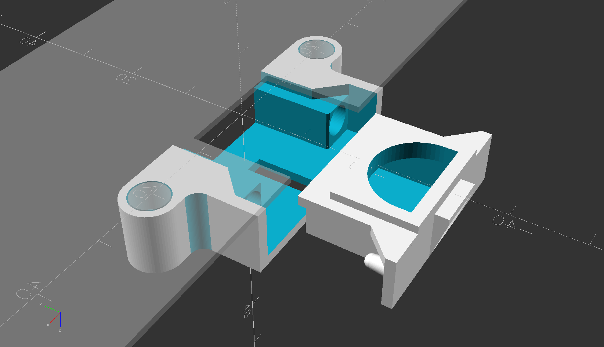
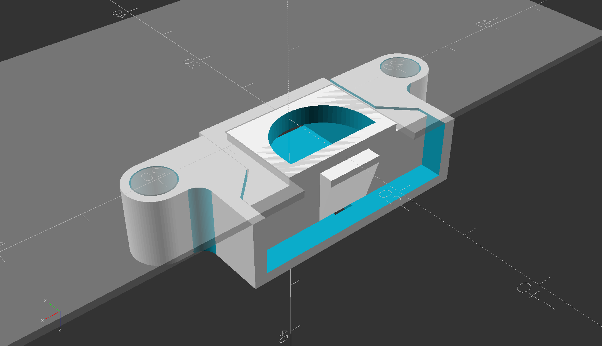
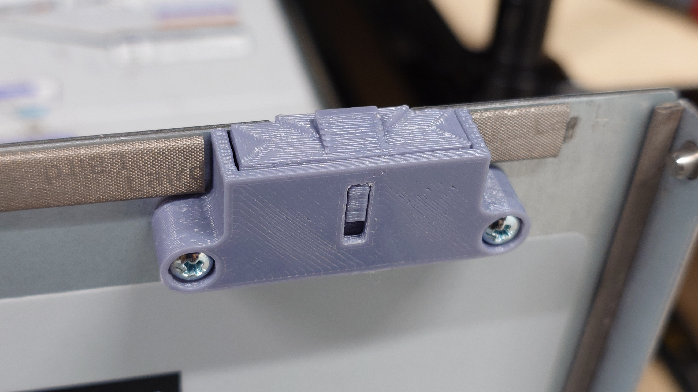

# T5120_top_cover_latch

Printable replacement top cover latch parts for SUN / Oracle SPARC Enterprise T5120 & T5220 servers

  
  

  
  
  
  
  
  
  
  

## compatibility

The new parts are both compatible with the mating original parts.  
So for example if your original frame is broken but you still have the original bolt, you can keep using the original bolt.

## hardware

Common pen springs work in place of the original springs.

The original mounting screws are M3 x 6mm
