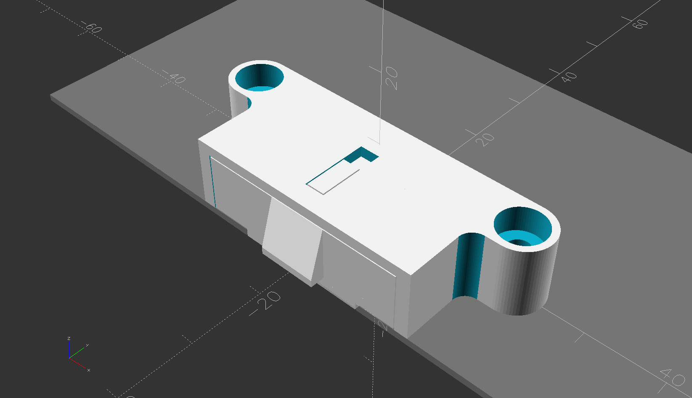

# T5120_top_cover_latch

Printable replacement for the latch parts on a SUN/Oracle Sparc T5120 server.

The FDM frame is modified slightly for FDM printing. The screw head pocket has a conical/funnel bottom which makes a 45 degree overhang when printing.

The new parts are both compatible with the mating original parts.

Common pen springs work in place of the original springs.

The screws are 3M x 6mm

