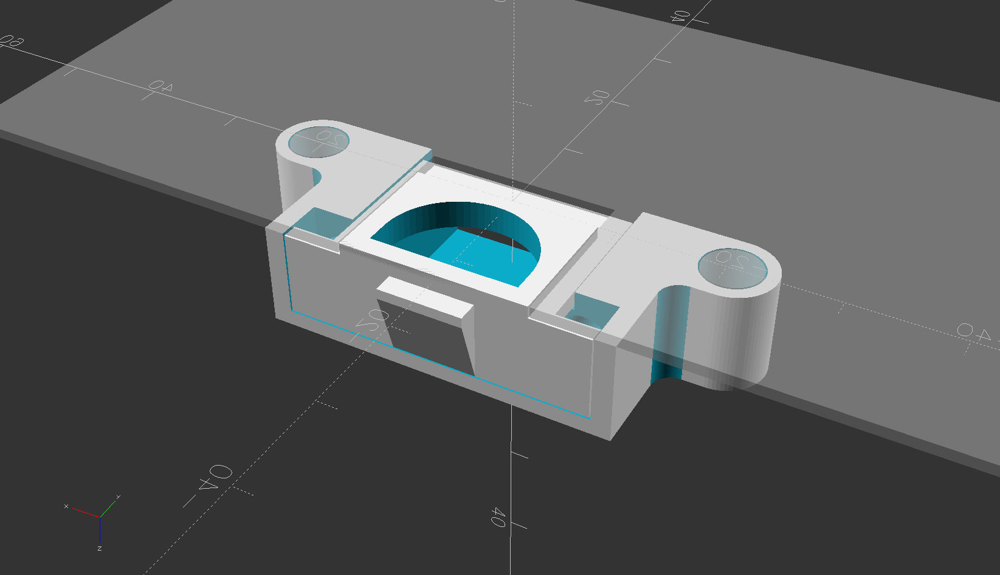
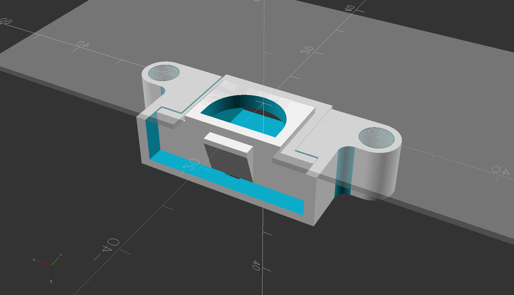

# T5120_top_cover_latch

Printable replacement top cover latch parts for a SUN Sparc T5120 server.

  
  

## compatibility
The new parts are both compatible with the mating original parts.  
So for example if your frame is broken but you still have the original bolt (the green moving part), you can keep using the original bolt.

## printing

### frame
For printing by FDM use the FDM frame, top face down.

The FDM version of the frame just has a conical bottom to the screw head pockets so that they make 45 degree overhangs that print without supports.  

But the screws are not conical so the SLS version has flat screw flange.
Use the SLS frame for any non-FDM printing like SLS, MJF, resin, etc.

### bolt
There is really no good orientation to print the bolt by FDM. The best is with the pawl face down on supports.
The springs put constant pressure on the wings so it should not be printed on it's side, only flat or vertical.

## hardware
Common pen springs work in place of the original springs.

The mounting screws are M3 x 6mm
