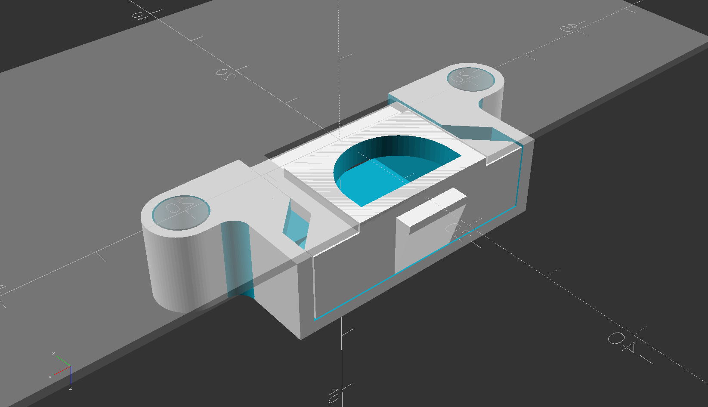

# T5120_top_cover_latch

Printable replacement top cover latch parts for SUN / Oracle SPARC Enterprise T5120 & T5220 servers

  
  

  
  
  
  
  
  

## compatibility

The new parts are both compatible with the mating original parts.  
So for example if your original frame is broken but you still have the original bolt, you can keep using the original bolt.

## printing

The springs place a constant load on the front face wings , so you want to use ABS, ASA, or PETG, not PLA for long-term / permanent installation.  

The STL files with "(FDM)" are modified slightly for FDM printing.  
* the fitment clearance between all parts is increased  
* the screw head pockets are conical to make 45 degree overhang to print without supports

There is really no good orientation to print the bolt by FDM. The best is with the pawl face down, on supports.
The springs put constant pressure on the wings so it should not be printed on it's side, only flat or vertical.

The frame does not need supports with the top face down.

## hardware

Common pen springs work in place of the original springs.

The original mounting screws are M3 x 6mm
